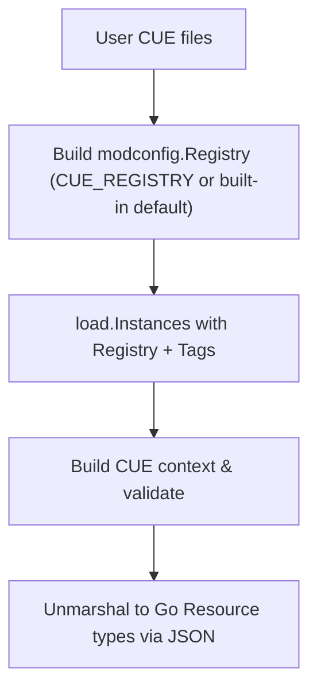
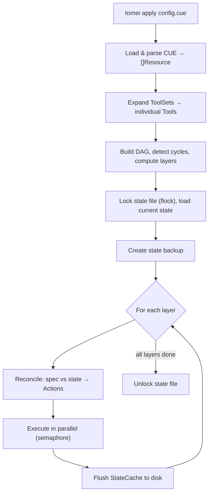
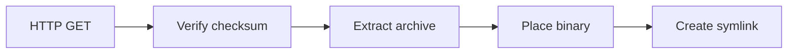
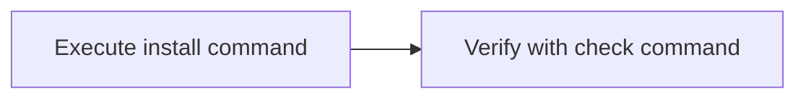

# Architecture

This document describes how `tomei` is implemented.

## Configuration Loading

CUE manifests are loaded via OCI registry resolution:



The loader builds a `modconfig.Registry` from the `CUE_REGISTRY` environment variable (defaulting to `tomei.terassyi.net=ghcr.io/terassyi`). The registry resolves imports like `tomei.terassyi.net/presets/go` by fetching the published CUE module from the OCI registry. A `cue.mod/` directory is required for directory-mode loading (package-based CUE files). Use `tomei cue init` to generate it.

CUE's `@tag()` injection does not propagate to imported packages resolved via a registry. Therefore presets that need platform information accept explicit `platform` parameters from the user manifest (e.g., `gopreset.#GoRuntime & { platform: { os: _os, arch: _arch } }`).

### Schema validation

Schema constraints are enforced via CUE-native imports. Presets import `tomei.terassyi.net/schema`, so type constraints (HTTPS-only URLs, name patterns, required fields) are applied automatically when using presets. User manifests can also import the schema directly for explicit validation. The loader uses `cue.Value.Decode()` to convert validated CUE values into Go structs.

## Resource System

### Core types

```go
type Kind string   // "Runtime", "Tool", "Installer", "ToolSet", ...

type Spec interface {
    Validate() error
    Dependencies() []Ref
}

type State interface { isState() }

type Resource interface {
    Kind() Kind
    Name() string
    Labels() map[string]string
    Spec() Spec
}
```

### Version classification

```go
type VersionKind string
// VersionExact:  "1.25.5"  — compared directly
// VersionLatest: ""        — updated on --sync
// VersionAlias:  "stable"  — resolved to actual version, aliases compared
```

### Expandable interface

For example, `ToolSet` implements `Expandable`. At load time, a `ToolSet` is expanded into a list of individual `Tool` resources.

```go
type Expandable interface {
    Resource
    Expand() ([]Resource, error)
}
```

## Dependency Graph

The `graph` package builds a DAG from resource dependencies.

### Data structure

```go
type dag struct {
    nodes    map[NodeID]*Node                // "Kind/Name" -> Node
    edges    map[NodeID]map[NodeID]struct{}  // dependency edges
    inDegree map[NodeID]int                  // number of dependencies
}
```

### Cycle detection

Uses DFS with three-color marking:

- **White**: unvisited
- **Gray**: in current DFS path
- **Black**: all descendants processed

An edge to a gray node is a back edge, indicating a cycle. Detected early by `tomei validate`.

### Topological sort

Kahn's algorithm produces execution **layers** — groups of nodes with no inter-dependencies. Nodes within a layer are sorted by kind priority (Runtime=100, Installer=200, Tool=300) then by name for deterministic ordering.

```
Layer 0: [Runtime/go]                          -- no dependencies
Layer 1: [Tool/bat, Tool/fd, Tool/gopls, ...]  -- depend on layer 0
```

## Execution Engine

The engine (`internal/installer/engine/`) orchestrates the full apply process.

### Flow



### Reconciliation

The reconciler compares spec with state and generates actions:

| Condition | Action |
|-----------|--------|
| Spec exists, state doesn't | Install |
| Spec exists, state differs | Upgrade |
| Spec exists, state matches | None |
| State exists, spec doesn't | Remove |
| State has taintReason set | Reinstall |

### Parallel execution

- Configurable concurrency (1–20, default 5)
- Semaphore-based: goroutines per layer, up to the configured limit
- StateCache provides thread-safe in-memory state updates
- State is flushed to disk after each layer completes

### Events

The engine emits events (`EventStart`, `EventProgress`, `EventOutput`, `EventComplete`, `EventError`) consumed by the UI layer for progress display.

## State Management

### File structure

```
~/.local/share/tomei/
├── state.lock   # flock file (contains PID of holder)
└── state.json   # persisted state
```

### Locking

Uses `flock` (advisory lock) on `state.lock`. On successful lock acquisition, the process writes its PID. On failure, reads the existing PID for a helpful error message.

### Write flow

1. Acquire flock on `state.lock`
2. Write PID
3. Read `state.json`
4. Write to `state.json.tmp`
5. `rename(state.json.tmp, state.json)` — atomic
6. Release flock

### StateCache

During execution, state is held in memory by `StateCache`:

- Mutex-protected for concurrent access from parallel goroutines
- `dirty` flag tracks whether changes need flushing
- `Flush()` writes to disk after each execution layer
- `cachedStore[S]` + `mapAccessor[S]` provide type-safe access to each state map (Tools, Runtimes, etc.)

### state.json structure

```json
{
  "version": "1",
  "registry": { ... },
  "runtimes": { "<name>": { "type", "version", "digest", "installPath", ... } },
  "installers": { "<name>": { ... } },
  "installerRepositories": { "<name>": { ... } },
  "tools": { "<name>": { "installerRef", "version", "digest", "binPath", "taintReason", ... } }
}
```

## Installer Implementation

### Download pattern



1. **download/**: Fetches files via HTTP with progress callbacks. Supports `GITHUB_TOKEN` / `GH_TOKEN` for authenticated requests.
2. **checksum/**: Verifies SHA256 (or MD5) against inline value or remote checksum file.
3. **extract/**: Handles tar.gz, zip, and raw (single binary) archives.
4. **place/**: Copies the binary to the install path and creates a symlink in `~/.local/bin/`.

### Delegation pattern



Uses `exec.Command` with explicit arguments (no shell injection). Environment variables from Runtime's `env` field are automatically set.

### Aqua registry integration

The aqua registry is cloned as a shallow git repository. Package metadata (download URLs, binary names, archive types) is resolved from the registry at apply time.

### PATH propagation for toolRef

When an Installer has a `toolRef` (e.g., Installer/binstall depends on Tool/cargo-binstall), `tomei` prepends the referenced tool's bin directory to `PATH` when executing delegation commands.

## Taint Logic

When a Runtime is upgraded, all Tools with `runtimeRef` pointing to that Runtime are marked with `taintReason: "runtime_upgraded"`. On the next reconciliation, tainted tools are reinstalled.

This ensures that tools compiled against a specific runtime version are rebuilt when the runtime changes (e.g., `go install` tools after a Go upgrade).

## Logging

Uses `log/slog` for structured logging.

| Level | Usage |
|-------|-------|
| Debug | HTTP response details, file sizes, algorithm attempts |
| Info | Operation start/completion pairs (download started, checksum verified) |
| Warn | Recoverable issues, skipped operations |
| Error | Failures affecting functionality (also returns error) |

Guidelines:
- Use structured key-value pairs: `slog.Info("downloading", "url", url, "dest", path)`
- Keep messages concise and human-readable
- Debug for development/troubleshooting, Info for operation tracking

## Error Handling

Structured errors with categories and codes (`internal/errors/`):

```go
type Error struct {
    Category Category         // config, validation, dependency, install, ...
    Code     Code             // E101, E201, E301, ...
    Message  string
    Details  map[string]any
    Hint     string           // Actionable advice
    Cause    error
}
```

Error codes:
- **E1xx**: Dependency errors (cyclic, missing)
- **E2xx**: Config errors (parse, validation)
- **E3xx**: Install errors (failed, checksum mismatch)
- **E4xx**: Network errors
- **E5xx**: State errors (locked, corrupt)
- **E6xx**: Registry errors

## Testing Strategy

### Unit tests

Location: `internal/*/_test.go`

- Single component in isolation with mocks/stubs
- No network access, no file system side effects (`t.TempDir()`)
- Fast execution (< 1s per test)
- Table-driven tests with `testify`
- Property-based tests with `rapid` for invariant verification

### Integration tests

Location: `tests/`

- Multiple component integration (CUE config → Resource → State)
- Mock installers (no real downloads)
- Real file system operations in temp directories

### E2E tests

Location: `e2e/`

- **Must run in Docker containers** (`make test-e2e`)
- Real downloads and installations
- Ginkgo v2 BDD framework
- Supports linux amd64/arm64 via `GOARCH` override
- Schema management tests: schema validation, init guard, apply confirmation

## Versioning

### Binary versioning

The `tomei` binary version follows semver and is tracked via `v*` git tags (e.g., `v0.1.0`). Releases are built by goreleaser.

### CUE module versioning

The CUE module (`tomei.terassyi.net@v0`) version is **independent of the binary version**. Module versions follow semver and are tracked via `tomei-cue-v*` git tags (e.g., `tomei-cue-v0.0.1`).

This separation allows schema and presets to evolve on their own cadence without forcing a tomei binary release. While in `@v0`, breaking changes to the module are permitted.

See [Module Publishing](module-publishing.md) for the publish workflow.

## CI

Defined in `.github/workflows/`.

### ci.yaml

Triggered on push to `main` and pull requests. Jobs run in sequence:

1. **Build** — compile `tomei`
2. **Unit Test** + **Lint** + **CUE Validate** — run in parallel after build
3. **Integration Test** — after all parallel jobs pass
4. **Build E2E** — cross-compile for linux/amd64, linux/arm64, darwin/arm64
5. **E2E Test** — matrix of platform x mode (native + container for linux, native for darwin)

### release.yaml

Triggered on `v*` tag push or manual `workflow_dispatch`.

- Runs CI first (or verifies CI already passed for manual dispatch)
- Uses `goreleaser` to build and publish releases
- Cross-compiles linux/darwin x amd64/arm64

See [Releasing](releasing.md) for the release process.

### publish-module.yaml

Triggered on `tomei-cue-v*` tag push (dry run) or manual `workflow_dispatch` (publish).

See [Module Publishing](module-publishing.md) for details.
