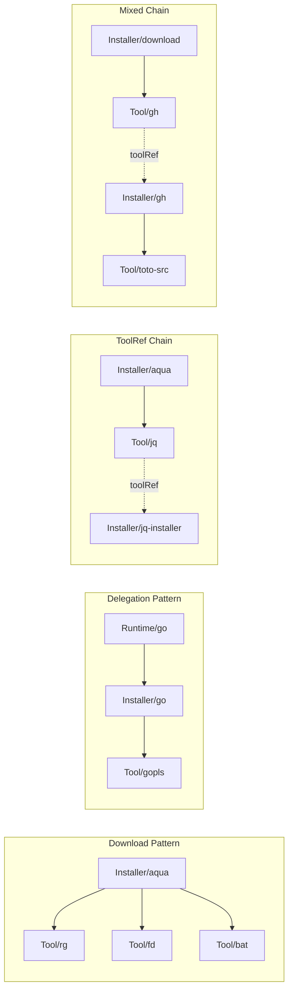

# E2E Test Scenarios

This document describes the scenarios verified by toto's E2E tests.

## Test Environment

- **Container**: Ubuntu 24.04-based Docker container (arm64)
- **Image**: `toto-ubuntu:test`
- **Container Name**: `toto-e2e-ubuntu`
- **User**: `testuser` (non-root)
- **Environment Variable**: `TOTO_E2E_CONTAINER` specifies the container name
- **Config Files**: CUE manifests pre-copied to `/home/testuser/manifests/`

## Test Suite Overview

| Suite | Tests | Description |
|-------|-------|-------------|
| toto on Ubuntu | 27 | Basic commands, installation, idempotency, doctor, runtime upgrade |
| Aqua Registry | 10 | Registry initialization, tool installation via aqua registry, OS/arch resolution |
| Dependency Resolution | 15 | Circular dependency detection, parallel installation, --parallel flag, dependency chains, toolRef chain |

## Scenario Flow

```mermaid
flowchart TD
    subgraph S1["1. toto on Ubuntu"]
        direction TB
        S1_1["1.1 Basic Commands<br/>version / init / validate / plan"]
        S1_2["1.2 Apply<br/>Runtime(go 1.25.5) + Tool(gh) + Tool(gopls)"]
        S1_3["1.3-1.5 Verify<br/>directories / symlinks / state.json"]
        S1_6["1.6 Idempotency<br/>total_actions=0"]
        S1_7["1.7 Delegation<br/>gopls via go install"]
        S1_8["1.8 Doctor<br/>unmanaged tool detection"]
        S1_9["1.9 Runtime Upgrade<br/>go 1.25.5 → 1.25.6 + taint"]

        S1_1 --> S1_2 --> S1_3 --> S1_6 --> S1_7 --> S1_8 --> S1_9
    end

    subgraph S2["2. Aqua Registry"]
        direction TB
        S2_1["2.1 Init<br/>registry ref in state.json"]
        S2_2["2.2 Install<br/>rg 15.1.0 / fd 10.3.0 / jq 1.8.1"]
        S2_3["2.3-2.5 Verify<br/>arch / state / --sync"]
        S2_6["2.6 Idempotency"]
        S2_7["2.7 Upgrade/Downgrade<br/>version switch + idempotency"]

        S2_1 --> S2_2 --> S2_3 --> S2_6 --> S2_7
    end

    subgraph S3["3. Dependency Resolution"]
        direction TB
        S3_1["3.1 Circular Detection<br/>2-node / 3-node / invalid"]
        S3_2["3.2 Parallel Install<br/>rg + fd + bat (download)"]
        S3_2_1["3.2.1 --parallel Flag<br/>--parallel 1 (seq) / default<br/>Downloads: header once"]
        S3_2_2["3.2.2 Mixed Parallel<br/>Runtime(go) → Tool(gopls)<br/>dependency order in parallel"]
        S3_3["3.3 ToolRef Chain<br/>aqua → jq → jq-installer"]
        S3_4["3.4 Tool→Installer→Tool<br/>gh → gh-installer → toto-src"]
        S3_5["3.5 Runtime→Tool Chain<br/>go → go-installer → gopls"]

        S3_1 --> S3_2 --> S3_2_1 --> S3_2_2 --> S3_3 --> S3_4 --> S3_5
    end

    S1 --> S2 --> S3
```



### Dependency Graph Patterns



---

## 1. toto on Ubuntu (Basic Functionality)

### 1.1 Basic Commands

#### `toto version`
- Displays version information
- Output contains "toto version"

#### `toto init`
- Run with `--yes --force` options
- Verifies creation of:
  - `~/.config/toto/config.cue` (contains `package toto`)
  - `~/.local/share/toto/` directory
  - `~/.local/bin/` directory
  - `~/.local/share/toto/state.json` (contains `version` field)

#### `toto validate`
- Validates CUE configuration in `~/manifests/`
- Outputs "Validation successful"
- Displays recognized resources:
  - Tool/gh
  - Tool/gopls
  - Runtime/go

#### `toto plan`
- Shows execution plan
- Output contains "Found" and "resource"

### 1.2 Runtime and Tool Installation

#### `toto apply` (Initial Run)
- Installs Runtime (Go 1.25.5)
- Installs Tool (gh 2.86.0 - download pattern)
- Installs Tool (gopls v0.21.0 - runtime delegation pattern)
- Output contains:
  - "installing runtime", "name=go", "runtime installed"
  - "installing tool", "name=gh", "tool installed"
  - "name=gopls"

### 1.3 Runtime Installation Verification

#### Directory Structure
- Placed in `~/.local/share/toto/runtimes/go/1.25.5/`
- `bin/` directory exists

#### Symbolic Links
- `~/go/bin/go` → `~/.local/share/toto/runtimes/go/1.25.5/bin/go`
- `~/go/bin/gofmt` → `~/.local/share/toto/runtimes/go/1.25.5/bin/gofmt`
- Verifies go and gofmt symlinks are **NOT** in `~/.local/bin/`

#### Execution Verification
- `GOTOOLCHAIN=local ~/go/bin/go version` → contains "go1.25.5"
- `~/go/bin/gofmt -h` → contains "usage"

### 1.4 Tool Installation Verification (Download Pattern)

#### Directory Structure
- Placed in `~/.local/share/toto/tools/gh/2.86.0/`
- `gh` binary exists

#### Symbolic Links
- `~/.local/bin/gh` → binary in tools directory

#### Execution Verification
- `~/.local/bin/gh --version` → contains "gh version 2.86.0"

### 1.5 State Management (state.json)

#### Recorded Contents
- `runtimes` section:
  - go runtime version: "1.25.5"
  - binDir contains "go/bin"
- `tools` section:
  - gh tool version: "2.86.0"
  - gopls runtimeRef: "go"
  - gopls package: "golang.org/x/tools/gopls"

### 1.6 Idempotency

#### Subsequent Applies
- Outputs "total_actions=0" (no changes)
- Does NOT contain "installed successfully"

#### Functionality Check
- go, gh, gopls continue to work correctly

### 1.7 Runtime Delegation (go install)

#### gopls Installation Results
- Binary placed at `~/go/bin/gopls`
- `~/go/bin/gopls version` is executable
- Contains "golang.org/x/tools/gopls" and "v0.21.0"

### 1.8 Doctor (Environment Health Check)

#### Clean Environment
- Outputs "No issues found"

#### Unmanaged Tool Detection
1. Install goimports using toto-managed Go:
   ```bash
   export GOROOT=$HOME/.local/share/toto/runtimes/go/1.25.5
   export GOBIN=$HOME/go/bin
   ~/go/bin/go install golang.org/x/tools/cmd/goimports@latest
   ```
2. Run `toto doctor`
3. Verify:
   - Displayed in "[go]" section
   - "goimports" detected as "unmanaged"
   - "toto adopt" is suggested

### 1.9 Runtime Upgrade (1.25.5 → 1.25.6)

#### Plan Before Upgrade
1. Swap runtime config with upgraded version:
   ```bash
   mv ~/manifests/runtime.cue ~/manifests/runtime.cue.old
   mv ~/manifests/runtime.cue.upgrade ~/manifests/runtime.cue
   ```
2. Run `toto plan` to preview changes
3. Verify:
   - Output contains "Runtime/go"
   - Output contains "Execution Plan"

#### Upgrade Process
1. Run `toto apply`
2. Verify:
   - Output contains "installing runtime", "name=go", "version=1.25.6"

#### Post-Upgrade Verification
- `GOTOOLCHAIN=local ~/go/bin/go version` → contains "go1.25.6"
- New runtime placed in `~/.local/share/toto/runtimes/go/1.25.6/`
- Symlink `~/go/bin/go` points to new version (contains "1.25.6")

#### Taint Logic
- Dependent tools (gopls) are tainted and reinstalled
- gopls continues to work after runtime upgrade
- `~/go/bin/gopls version` → contains "golang.org/x/tools/gopls"

#### State Update
- state.json updated with new version: `"version": "1.25.6"`

#### Idempotency After Upgrade
- Second apply outputs "total_actions=0" (no changes)

---

## 2. Aqua Registry Integration

### 2.1 Registry Initialization

#### `toto init` with Registry
- Run `toto init --yes --force`
- Verifies state.json contains:
  - `registry.aqua.ref` (e.g., "v4.465.0")
  - `registry.aqua.updatedAt`

#### Registry Ref Format
- ref matches pattern `v\d+\.\d+\.\d+`

### 2.2 Tool Installation via Aqua Registry

#### Configuration
- 3 Tools installed via aqua registry (package field):
  - ripgrep 15.1.0 (`BurntSushi/ripgrep`)
  - fd v10.3.0 (`sharkdp/fd`)
  - jq jq-1.8.1 (`jqlang/jq`)

#### Validation
- `toto validate ~/manifests/registry/` succeeds
- Recognizes Tool/rg, Tool/fd, Tool/jq

#### Installation
- `toto apply ~/manifests/registry/` installs all tools
- Output contains "installing tool" and "tool installed"

#### Version Verification
- `~/.local/bin/rg --version` → "ripgrep 15.1.0"
- `~/.local/bin/fd --version` → "fd 10.3.0"
- `~/.local/bin/jq --version` → "jq-1.8.1"

### 2.3 OS/Arch Resolution

#### Binary Architecture
- `file ~/.local/bin/rg` → "ARM aarch64"
- Verifies aqua registry replacements work correctly for linux-arm64

### 2.4 State Recording

#### Package Field
- state.json contains package info for each tool:
  - `tools.rg.package` = "BurntSushi/ripgrep"
  - `tools.fd.package` = "sharkdp/fd"
  - `tools.jq.package` = "jqlang/jq"

### 2.5 Registry Sync

#### `--sync` Flag
- `toto apply --sync ~/manifests/registry/`
- Logs contain "aqua registry" message

### 2.6 Idempotency

#### Subsequent Applies
- Second `toto apply ~/manifests/registry/` outputs "total_actions=0"
- All tools continue to work correctly

### 2.7 Version Upgrade/Downgrade

#### Downgrade to Older Version
1. Swap manifest to older versions:
   ```bash
   mv ~/manifests/registry/tools.cue ~/manifests/registry/tools.cue.new
   mv ~/manifests/registry/tools.cue.old ~/manifests/registry/tools.cue
   ```
2. Run `toto apply ~/manifests/registry/`
3. Verify older versions installed:
   - `~/.local/bin/rg --version` → "ripgrep 14.1.1"
   - `~/.local/bin/fd --version` → "fd 10.2.0"
   - `~/.local/bin/jq --version` → "jq-1.7.1"

#### Upgrade to Newer Version
1. Swap manifest back to newer versions
2. Run `toto apply ~/manifests/registry/`
3. Verify newer versions installed:
   - `~/.local/bin/rg --version` → "ripgrep 15.1.0"
   - `~/.local/bin/fd --version` → "fd 10.3.0"
   - `~/.local/bin/jq --version` → "jq-1.8.1"

#### Idempotency After Version Changes
- Second apply outputs "total_actions=0"

---

## 3. Dependency Resolution

### 3.1 Circular Dependency Detection

#### Two-Node Cycle
```
Installer(a) → Tool(b) → Installer(a)
```
- Installer references Tool via toolRef
- Tool references that Installer via installerRef
- `toto validate` returns error
- Error message contains "circular dependency"

#### Three-Node Cycle
```
Tool(a) → Installer(c) → Tool(c) → Installer(b) → Tool(a)
```
- Circular reference involving 3 resources
- `toto validate` returns error
- Error message contains "circular dependency"

#### Both runtimeRef and toolRef Specified
- Installer specifies both runtimeRef and toolRef
- `toto validate` returns error
- Error message contains "runtimeRef" and "toolRef"

### 3.2 Parallel Tool Installation

#### Configuration
- aqua installer (download pattern)
- 3 independent Tools:
  - ripgrep 14.1.1
  - fd 10.2.0
  - bat 0.24.0

#### Verification
1. `toto validate` succeeds
2. `toto apply` installs all 3 tools
3. Version check for each tool:
   - `~/.local/bin/rg --version` → "ripgrep 14.1.1"
   - `~/.local/bin/fd --version` → "fd 10.2.0"
   - `~/.local/bin/bat --version` → "bat 0.24.0"

#### Idempotency
- Second apply outputs "total_actions=0" or "no changes"

### 3.2.1 `--parallel` Flag Behavior

#### Sequential Execution (`--parallel 1`)
- `toto apply --parallel 1 ~/dependency-test/parallel.cue`
- All 3 tools (rg, fd, bat) installed correctly
- Version verification:
  - `~/.local/bin/rg --version` → "ripgrep 14.1.1"
  - `~/.local/bin/fd --version` → "fd 10.2.0"
  - `~/.local/bin/bat --version` → "bat 0.26.1"
- Non-TTY output contains "Commands:" header exactly once

#### Default Parallelism (`--parallel 5`)
- `toto apply ~/dependency-test/parallel.cue` (no flag, default)
- All 3 tools installed correctly
- Non-TTY output contains "Commands:" header exactly once (no duplicates from concurrent writes)

### 3.2.2 Runtime and Tool Mixed Parallel Execution

#### Configuration
```
Runtime(go) → Installer(go) → Tool(gopls)
```
- Same as runtime-chain.cue but executed with default parallelism

#### Verification
1. `toto apply ~/dependency-test/runtime-chain.cue` succeeds
2. Go runtime installed before gopls (dependency order preserved in parallel mode):
   - `GOTOOLCHAIN=local ~/.local/share/toto/runtimes/go/1.23.5/bin/go version` → "go1.23"
   - `~/go/bin/gopls version` → "golang.org/x/tools/gopls"
3. state.json records both "go" and "gopls"

### 3.3 ToolRef Dependency Chain

#### Configuration
```
Installer(aqua) → Tool(jq) → Installer(jq-installer)
```
- aqua: download pattern Installer
- jq: Tool installed via aqua
- jq-installer: Installer referencing jq via toolRef

#### Verification
1. `toto validate` correctly recognizes dependencies:
   - Installer/aqua
   - Tool/jq
   - Installer/jq-installer
2. `toto apply` installs jq
3. `~/.local/bin/jq --version` → contains "jq-1.7"

### 3.4 Tool → Installer → Tool Chain (gh clone)

#### Configuration
```
Tool(gh) → Installer(gh) [toolRef] → Tool(toto-src)
```
- gh: Tool installed via download pattern
- gh installer: Installer referencing gh via toolRef, uses `gh repo clone`
- toto-src: Tool (repository) cloned via gh installer

#### Verification
1. `toto validate` recognizes all resources:
   - Tool/gh
   - Installer/gh
   - Tool/toto-src
2. `toto apply` installs gh tool first
3. gh is available: `~/.local/bin/gh --version`
4. toto repository is cloned:
   - `~/repos/toto-src/` directory exists
   - `~/repos/toto-src/go.mod` exists
   - `~/repos/toto-src/cmd/toto/main.go` exists

### 3.5 Runtime → Tool Dependency Chain

#### Configuration
```
Runtime(go) → Installer(go) → Tool(gopls)
```
- Go Runtime 1.23.5: download pattern
- Go Installer: references Go Runtime via runtimeRef
- gopls Tool: references Go Installer via installerRef and Go Runtime via runtimeRef

#### Verification
1. `toto validate` recognizes all resources:
   - Runtime/go
   - Installer/go
   - Tool/gopls
2. `toto apply` installs in correct order:
   - Runtime installed first
   - Tool installed after
3. Go 1.23.5 correctly installed:
   - `GOTOOLCHAIN=local ~/.local/share/toto/runtimes/go/1.23.5/bin/go version`
   - Contains "go1.23"
4. gopls correctly installed:
   - `~/go/bin/gopls version`
   - Contains "golang.org/x/tools/gopls"

---

## Running Tests

### Prerequisites
1. Docker installed

### Execution Steps

From the repository root:

```bash
# Run all E2E tests (recommended)
make test-e2e
```

This command automatically:
1. Builds toto binary for linux/arm64
2. Builds Docker image (`toto-ubuntu:test`) with:
   - toto binary installed at `/usr/local/bin/toto`
   - Config files pre-copied to `/home/testuser/manifests/`
   - Non-root user (`testuser`) for realistic testing
3. Starts container (`toto-e2e-ubuntu`)
4. Runs Ginkgo tests
5. Cleans up container

### Manual Execution (for debugging)

```bash
cd e2e

# Build binary and image
make build

# Start container
make up

# Run tests
make test

# Or exec into container for manual inspection
make exec

# Cleanup
make down
```

### Environment Variables

| Variable | Description | Default |
|----------|-------------|---------|
| `TOTO_E2E_CONTAINER` | Container name for tests | `toto-e2e-ubuntu` |

---

## Test Configuration Files

### `e2e/config/runtime.cue`
Go Runtime 1.25.5 definition (linux-arm64) - initial version

### `e2e/config/runtime.cue.upgrade`
Go Runtime 1.25.6 definition (linux-arm64) - upgraded version
(uses `.upgrade` extension to avoid CUE conflict when both files are in same directory)

### `e2e/config/tools.cue`
gh CLI 2.86.0 definition (linux-arm64, download pattern)

### `e2e/config/delegation.cue`
gopls v0.21.0 definition (runtime delegation pattern)

### `e2e/config/toolref.cue`
Tool → Installer → Tool chain definition:
- gh installer with toolRef (depends on gh tool)
- toto-src tool (cloned via gh installer)

### `e2e/config/registry/tools.cue`
Aqua registry-based tool definitions:
- ripgrep 15.1.0 (package: BurntSushi/ripgrep)
- fd v10.3.0 (package: sharkdp/fd)
- jq jq-1.8.1 (package: jqlang/jq)
