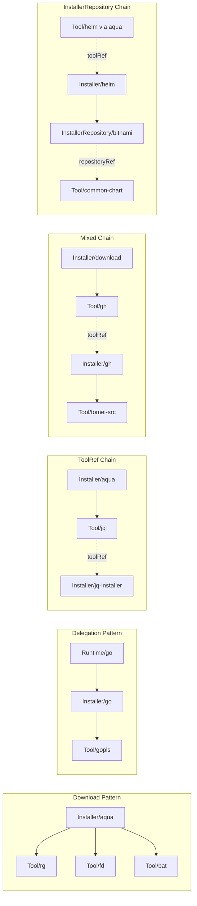

# E2E Test Scenarios

This document describes the scenarios verified by tomei's E2E tests.

## Test Environment

- **Container**: Ubuntu 24.04-based Docker container (arm64)
- **Image**: `tomei-ubuntu:test`
- **Container Name**: `tomei-e2e-ubuntu`
- **User**: `testuser` (non-root)
- **Environment Variable**: `TOMEI_E2E_CONTAINER` specifies the container name
- **Config Files**: CUE manifests pre-copied to `/home/testuser/manifests/`

## Test Suite Overview

| Suite | Tests | Description |
|-------|-------|-------------|
| tomei on Ubuntu | 33 | Basic commands, installation, env export, idempotency, doctor, runtime upgrade, resource removal |
| Schema Validation | 9 | Schema placement, invalid manifest rejection (validate/apply), error message quality |
| Schema Management | 9 | `tomei schema` command, apiVersion mismatch detection, init guard, apply confirmation |
| State Backup and Diff | 13 | Backup creation, diff (text/JSON), idempotent diff, upgrade diff, removal diff, backup overwrite |
| Aqua Registry | 10 | Registry initialization, tool installation via aqua registry, OS/arch resolution |
| Delegation Runtime | 9 | Rust runtime installation via delegation, cargo install tool, idempotency |
| Installer Repository | 13 | Helm repository management via delegation, dependency chain (InstallerRepository → Tool), removal |
| Dependency Resolution | 15 | Circular dependency detection, parallel installation, --parallel flag, dependency chains, toolRef chain |

## Scenario Flow

```mermaid
flowchart TD
    subgraph S1["1. tomei on Ubuntu"]
        direction TB
        S1_1["1.1 Basic Commands<br/>version / init / validate / plan"]
        S1_2["1.2 Apply<br/>Runtime(go 1.25.5) + Tool(gh) + Tool(gopls)"]
        S1_3["1.3-1.5 Verify<br/>directories / symlinks / state.json"]
        S1_5a["1.5a Environment Export<br/>tomei env / --shell fish / --export"]
        S1_6["1.6 Idempotency<br/>total_actions=0"]
        S1_7["1.7 Delegation<br/>gopls via go install"]
        S1_8["1.8 Doctor<br/>unmanaged tool detection"]
        S1_9["1.9 Runtime Upgrade<br/>go 1.25.5 → 1.25.6 + taint"]
        S1_10["1.10 Resource Removal<br/>dependency guard + tool/runtime removal"]

        S1_1 --> S1_2 --> S1_3 --> S1_5a --> S1_6 --> S1_7 --> S1_8 --> S1_9 --> S1_10
    end

    subgraph S1b["1b. State Backup and Diff"]
        direction TB
        S1b_1["1b.1 Diff Before First Apply<br/>No backup found message"]
        S1b_2["1b.2 Backup Creation<br/>state.json.bak created / differs from current"]
        S1b_3["1b.3 Diff After First Apply<br/>text / JSON / --no-color"]
        S1b_4["1b.4 Idempotent Diff<br/>No changes since last apply"]
        S1b_5["1b.5 Diff After Upgrade<br/>modified (old → new version)"]
        S1b_6["1b.6 Diff After Removal<br/>removed tool in diff"]
        S1b_7["1b.7 Backup Overwrite<br/>backup updated on each apply"]

        S1b_1 --> S1b_2 --> S1b_3 --> S1b_4 --> S1b_5 --> S1b_6 --> S1b_7
    end

    subgraph S2["2. Aqua Registry"]
        direction TB
        S2_1["2.1 Init<br/>registry ref in state.json"]
        S2_2["2.2 Install<br/>rg 15.1.0 / fd 10.3.0 / jq 1.8.1"]
        S2_3["2.3-2.5 Verify<br/>arch / state / --sync"]
        S2_6["2.6 Idempotency"]
        S2_7["2.7 Upgrade/Downgrade<br/>version switch + idempotency"]

        S2_1 --> S2_2 --> S2_3 --> S2_6 --> S2_7
    end

    subgraph S3["3. Delegation Runtime"]
        direction TB
        S3_1["3.1 Rust Runtime<br/>delegation install + cargo"]
        S3_2["3.2 Cargo Install Tool<br/>sd via cargo install"]
        S3_3["3.3 Idempotency<br/>subsequent applies"]

        S3_1 --> S3_2 --> S3_3
    end

    subgraph S4["4. Installer Repository"]
        direction TB
        S4_1["4.1 Delegation: Helm Repository<br/>aqua → helm tool → bitnami repo"]
        S4_2["4.2 Dependency Chain<br/>InstallerRepository → Tool (helm pull)"]
        S4_3["4.3 Removal<br/>bitnami repo + common-chart removal"]

        S4_1 --> S4_2 --> S4_3
    end

    subgraph S5["5. Dependency Resolution"]
        direction TB
        S5_1["5.1 Circular Detection<br/>2-node / 3-node / invalid"]
        S5_2["5.2 Parallel Install<br/>rg + fd + bat (download)"]
        S5_2_1["5.2.1 --parallel Flag<br/>--parallel 1 (seq) / default<br/>Downloads: header once"]
        S5_2_2["5.2.2 Mixed Parallel<br/>Runtime(go) → Tool(gopls)<br/>dependency order in parallel"]
        S5_3["5.3 ToolRef Chain<br/>aqua → jq → jq-installer"]
        S5_4["5.4 Tool→Installer→Tool<br/>gh → gh-installer → tomei-src"]
        S5_5["5.5 Runtime→Tool Chain<br/>go → go-installer → gopls"]

        S5_1 --> S5_2 --> S5_2_1 --> S5_2_2 --> S5_3 --> S5_4 --> S5_5
    end

    subgraph S1a["1a. Schema Validation"]
        direction TB
        S1a_1["1a.1 Init Schema Placement<br/>default / --schema-dir custom"]
        S1a_2["1a.2 Validate Rejects Invalid<br/>apiVersion / URL / name / source / checksum"]
        S1a_3["1a.3 Apply Rejects Invalid<br/>HTTP URL → fail, state unchanged"]
        S1a_4["1a.4 Error Message Quality<br/>resource name in error"]

        S1a_1 --> S1a_2 --> S1a_3 --> S1a_4
    end

    S1 --> S1a --> S1b --> S2 --> S3 --> S4 --> S5
```



### Dependency Graph Patterns



---

## 1. tomei on Ubuntu (Basic Functionality)

### 1.1 Basic Commands

#### `tomei version`
- Displays version information
- Output contains "tomei version"

#### `tomei init`
- Run with `--yes --force` options
- Verifies creation of:
  - `~/.config/tomei/config.cue` (contains `package tomei`)
  - `~/.local/share/tomei/` directory
  - `~/.local/bin/` directory
  - `~/.local/share/tomei/state.json` (contains `version` field)

#### `tomei validate`
- Validates CUE configuration in `~/manifests/`
- Outputs "Validation successful"
- Displays recognized resources:
  - Tool/gh
  - Tool/gopls
  - Runtime/go

#### `tomei plan`
- Shows execution plan
- Output contains "Found" and "resource"

### 1.2 Runtime and Tool Installation

#### `tomei apply` (Initial Run)
- Installs Runtime (Go 1.25.5)
- Installs Tool (gh 2.86.0 - download pattern)
- Installs Tool (gopls v0.21.0 - runtime delegation pattern)
- Output contains:
  - "installing runtime", "name=go", "runtime installed"
  - "installing tool", "name=gh", "tool installed"
  - "name=gopls"

### 1.3 Runtime Installation Verification

#### Directory Structure
- Placed in `~/.local/share/tomei/runtimes/go/1.25.5/`
- `bin/` directory exists

#### Symbolic Links
- `~/go/bin/go` → `~/.local/share/tomei/runtimes/go/1.25.5/bin/go`
- `~/go/bin/gofmt` → `~/.local/share/tomei/runtimes/go/1.25.5/bin/gofmt`
- Verifies go and gofmt symlinks are **NOT** in `~/.local/bin/`

#### Execution Verification
- `GOTOOLCHAIN=local ~/go/bin/go version` → contains "go1.25.5"
- `~/go/bin/gofmt -h` → contains "usage"

### 1.4 Tool Installation Verification (Download Pattern)

#### Directory Structure
- Placed in `~/.local/share/tomei/tools/gh/2.86.0/`
- `gh` binary exists

#### Symbolic Links
- `~/.local/bin/gh` → binary in tools directory

#### Execution Verification
- `~/.local/bin/gh --version` → contains "gh version 2.86.0"

### 1.5 State Management (state.json)

#### Recorded Contents
- `runtimes` section:
  - go runtime version: "1.25.5"
  - binDir contains "go/bin"
- `tools` section:
  - gh tool version: "2.86.0"
  - gopls runtimeRef: "go"
  - gopls package: "golang.org/x/tools/gopls"

### 1.5a Environment Export

#### POSIX Output (`tomei env`)
1. Run `tomei env`
2. Verify:
   - Output contains `export GOROOT=`
   - Output contains `export GOBIN=`
   - Output contains `go/bin` and `.local/bin` in PATH
   - Output is eval-safe and PATH works: `eval '<output>' && GOTOOLCHAIN=local go version` succeeds

#### Fish Output (`tomei env --shell fish`)
1. Run `tomei env --shell fish`
2. Verify:
   - Output contains `set -gx GOROOT`
   - Output contains `fish_add_path`

#### File Export (`tomei env --export`)
1. Run `tomei env --export`
2. Verify:
   - Output mentions `env.sh` file
   - File `~/.config/tomei/env.sh` exists
   - File contains `export GOROOT=`
   - File contains `export PATH=`

### 1.6 Idempotency

#### Subsequent Applies
- Outputs "total_actions=0" (no changes)
- Does NOT contain "installed successfully"

#### Functionality Check
- go, gh, gopls continue to work correctly

### 1.7 Runtime Delegation (go install)

#### gopls Installation Results
- Binary placed at `~/go/bin/gopls`
- `~/go/bin/gopls version` is executable
- Contains "golang.org/x/tools/gopls" and "v0.21.0"

### 1.8 Doctor (Environment Health Check)

#### Clean Environment
- Outputs "No issues found"

#### Unmanaged Tool Detection
1. Install goimports using tomei-managed Go:
   ```bash
   export GOROOT=$HOME/.local/share/tomei/runtimes/go/1.25.5
   export GOBIN=$HOME/go/bin
   ~/go/bin/go install golang.org/x/tools/cmd/goimports@latest
   ```
2. Run `tomei doctor`
3. Verify:
   - Displayed in "[go]" section
   - "goimports" detected as "unmanaged"
   - Suggestions section is shown

### 1.9 Runtime Upgrade (1.25.5 → 1.25.6)

#### Plan Before Upgrade
1. Swap runtime config with upgraded version:
   ```bash
   mv ~/manifests/runtime.cue ~/manifests/runtime.cue.old
   mv ~/manifests/runtime.cue.upgrade ~/manifests/runtime.cue
   ```
2. Run `tomei plan` to preview changes
3. Verify:
   - Output contains "Runtime/go"
   - Output contains "Execution Plan"

#### Upgrade Process
1. Run `tomei apply`
2. Verify:
   - Output contains "installing runtime", "name=go", "version=1.25.6"

#### Post-Upgrade Verification
- `GOTOOLCHAIN=local ~/go/bin/go version` → contains "go1.25.6"
- New runtime placed in `~/.local/share/tomei/runtimes/go/1.25.6/`
- Symlink `~/go/bin/go` points to new version (contains "1.25.6")

#### Taint Logic
- Dependent tools (gopls) are tainted and reinstalled
- gopls continues to work after runtime upgrade
- `~/go/bin/gopls version` → contains "golang.org/x/tools/gopls"

#### State Update
- state.json updated with new version: `"version": "1.25.6"`

#### Idempotency After Upgrade
- Second apply outputs "total_actions=0" (no changes)

### 1.10 Resource Removal

#### Removal Blocked by Dependent Tool
1. Hide runtime manifest:
   ```bash
   mv ~/manifests/runtime.cue ~/manifests/runtime.cue.hidden
   ```
2. Run `tomei apply ~/manifests/`
3. Verify:
   - Apply fails with error
   - Error contains "cannot remove runtime"
   - Error contains "gopls" (the dependent tool)
4. Restore runtime manifest:
   ```bash
   mv ~/manifests/runtime.cue.hidden ~/manifests/runtime.cue
   ```

#### Tool Removal (No Dependencies)
1. Hide tool manifest:
   ```bash
   mv ~/manifests/tools.cue ~/manifests/tools.cue.hidden
   ```
2. Run `tomei apply ~/manifests/`
3. Verify:
   - Apply succeeds
   - `~/.local/bin/gh` symlink no longer exists
   - state.json does not contain `"gh"`

#### Runtime and All Dependent Tools Removed Together
1. Hide runtime, delegation, and toolset manifests:
   ```bash
   mv ~/manifests/runtime.cue ~/manifests/runtime.cue.hidden
   mv ~/manifests/delegation.cue ~/manifests/delegation.cue.hidden
   mv ~/manifests/toolset.cue ~/manifests/toolset.cue.hidden
   ```
2. Run `tomei apply ~/manifests/`
3. Verify:
   - Apply succeeds (no blocking — all dependents removed)
   - `~/go/bin/go` symlink no longer exists
   - `~/go/bin/gopls` binary no longer exists
   - state.json does not contain `"go"` or `"gopls"`

---

## 1a. Schema Validation

### 1a.1 Init Schema Placement

#### Default Location
- `tomei init --yes` places `schema.cue` at `~/.config/tomei/schema.cue`
- File contains key CUE definitions:
  - `package tomei`
  - `#APIVersion`
  - `#Resource`
  - `#HTTPSURL`
  - `#Metadata`

#### Custom Directory (`--schema-dir`)
1. Create custom directory: `~/custom-schema-dir/`
2. Run `tomei init --yes --force --schema-dir ~/custom-schema-dir`
3. Verify `~/custom-schema-dir/schema.cue` exists and contains `#APIVersion`, `#Resource`
4. Cleanup custom directory
5. Re-initialize with default settings for subsequent tests

### 1a.2 Validate Rejects Invalid Manifests

All tests write an inline CUE manifest to `~/schema-test/` and run `tomei validate` against it.

#### Wrong apiVersion
- `apiVersion: "wrong/v1"` (not `"tomei.terassyi.net/v1beta1"`)
- `tomei validate` fails with "validation failed"

#### Non-HTTPS URL
- `source.url: "http://example.com/tool.tar.gz"` (HTTP, not HTTPS)
- `tomei validate` fails with "validation failed"

#### Invalid Metadata Name
- `metadata.name: "INVALID_NAME"` (uppercase, underscore — violates regex)
- `tomei validate` fails with "validation failed"

#### Runtime Download Without Source
- `kind: "Runtime"`, `spec.type: "download"`, no `source` field
- CUE conditional constraint: `if type == "download" { source: #DownloadSource }`
- `tomei validate` fails with "validation failed"

#### Invalid Checksum Format
- `checksum.value: "md5:abc123"` (not `sha256:<64 hex chars>`)
- `tomei validate` fails with "validation failed"

### 1a.3 Apply Rejects Invalid Manifests

#### State Preservation on Failure
1. Record `state.json` content before apply
2. Write manifest with non-HTTPS URL
3. Run `tomei apply` — fails with "failed to load resources"
4. Verify `state.json` content is unchanged (byte-for-byte equal)

### 1a.4 Error Message Quality

#### Resource Name in Error
1. Create directory `~/schema-test/bad-dir/` with `package tomei` manifest
2. Define named field `badTool:` containing a Tool with non-HTTPS URL
3. Run `tomei validate ~/schema-test/bad-dir/`
4. Error contains "schema validation failed" and "badTool"

---

## 1c. Schema Management

### 1c.1 `tomei schema` Command

#### Create Schema
1. Create empty directory `~/schema-mgmt-test/new-dir/`
2. Run `tomei schema ~/schema-mgmt-test/new-dir`
3. Output contains "Created"
4. `~/schema-mgmt-test/new-dir/schema.cue` contains `package tomei` and `#APIVersion`

#### Up-to-date Schema
1. Run `tomei schema ~/schema-mgmt-test/new-dir` again
2. Output contains "up to date"

#### Update Schema
1. Overwrite `schema.cue` with `package tomei` (minimal content)
2. Run `tomei schema ~/schema-mgmt-test/new-dir`
3. Output contains "Updated"

#### Default Directory
1. Run `tomei schema` (no arguments)
2. Command succeeds (schema.cue in working directory from init)

### 1c.2 Schema apiVersion Mismatch

#### Apply Rejects Mismatch
1. Create `~/schema-mgmt-test/mismatch/schema.cue` with `#APIVersion: "tomei.terassyi.net/v0old"`
2. Create valid manifest `~/schema-mgmt-test/mismatch/tools.cue`
3. Run `tomei apply --yes ~/schema-mgmt-test/mismatch/`
4. Error contains "apiVersion mismatch" and "tomei schema"

#### Validate Rejects Mismatch
1. Run `tomei validate ~/schema-mgmt-test/mismatch/tools.cue`
2. Error contains "apiVersion mismatch"

#### Plan Rejects Mismatch
1. Run `tomei plan ~/schema-mgmt-test/mismatch/`
2. Error contains "apiVersion mismatch"

#### Fix and Succeed
1. Run `tomei schema ~/schema-mgmt-test/mismatch` to update schema.cue
2. Run `tomei validate ~/schema-mgmt-test/mismatch/tools.cue`
3. Validation succeeds

#### No Schema Skips Check
1. Create `~/schema-mgmt-test/no-schema/tools.cue` (no schema.cue in directory)
2. Run `tomei validate ~/schema-mgmt-test/no-schema/tools.cue`
3. Validation succeeds

### 1c.3 Init Guard

#### Apply Before Init
1. Move `~/.local/share/tomei/state.json` to backup
2. Run `tomei apply --yes ~/schema-mgmt-test/fresh-home/tools.cue`
3. Error contains "tomei is not initialized" and "tomei init"
4. Restore `state.json` from backup

### 1c.4 Apply Confirmation Prompt

#### Proceeds with --yes
1. Run `tomei apply --yes ~/manifests/`
2. Command succeeds
3. Output does not contain `[y/N]` prompt

---

## 1b. State Backup and Diff

### 1b.1 Diff Before First Apply

#### No Backup Message
- Environment is reset (init --force, backup/tools/runtimes removed)
- Run `tomei state diff`
- Outputs "No backup found"

### 1b.2 Backup Creation

#### `state.json.bak` Created During Apply
1. Record `state.json` content before apply
2. Run `tomei apply ~/manifests/`
3. Verify `state.json.bak` exists
4. Verify backup content matches pre-apply state

#### Backup Differs from Current State
- Current `state.json` contains go/gh/gopls versions
- Backup does NOT contain gh version (was empty state before apply)

### 1b.3 Diff After First Apply

#### Text Format
- `tomei state diff` shows "State changes" header
- Shows `+` marker for added resources
- Shows go (with version), gh (with version), gopls
- Summary line contains "added"

#### JSON Format
- `tomei state diff --output json`
- Contains `"changes"` array, `"type": "added"`
- Contains `"kind": "runtime"`, `"name": "go"`
- Contains `"kind": "tool"`, `"name": "gh"`

#### `--no-color` Flag
- `tomei state diff --no-color`
- Output does NOT contain ANSI escape codes (`\x1b[`)
- Output still contains "State changes" and diff content

### 1b.4 Diff After Idempotent Apply

#### No Changes
1. Run `tomei apply ~/manifests/` (second time, no changes)
2. Run `tomei state diff`
3. Output contains "No changes since last apply"

### 1b.5 Diff After Version Upgrade

#### Backup Contains Old Version
1. Swap `runtime.cue` with `runtime.cue.upgrade` (go version change)
2. Run `tomei apply ~/manifests/`
3. Backup contains old go version
4. Current state contains new go version

#### Text Diff Shows Modification
- `tomei state diff` shows "State changes"
- Contains go, old version, new version
- Summary contains "modified"

#### JSON Diff Shows Modification
- `tomei state diff --output json`
- Contains `"type": "modified"`, `"name": "go"`
- Contains `"oldVersion"` and `"newVersion"` with correct versions

#### Cleanup
- Restore original `runtime.cue` and apply to revert

### 1b.6 Diff After Resource Removal

#### Text Diff Shows Removed
1. Hide `tools.cue` (rename to `.hidden`)
2. Run `tomei apply ~/manifests/`
3. `tomei state diff` shows gh with "removed"

#### JSON Diff Shows Removed
- `tomei state diff --output json`
- Contains `"type": "removed"`, `"name": "gh"`

#### Cleanup
- Restore `tools.cue` from `.hidden`

### 1b.7 Backup Overwrite

#### Overwrites on Each Apply
1. Record current backup content
2. Run `tomei apply ~/manifests/`
3. New backup content differs from previous backup

---

## 2. Aqua Registry Integration

### 2.1 Registry Initialization

#### `tomei init` with Registry
- Run `tomei init --yes --force`
- Verifies state.json contains:
  - `registry.aqua.ref` (e.g., "v4.465.0")
  - `registry.aqua.updatedAt`

#### Registry Ref Format
- ref matches pattern `v\d+\.\d+\.\d+`

### 2.2 Tool Installation via Aqua Registry

#### Configuration
- 3 Tools installed via aqua registry (package field):
  - ripgrep 15.1.0 (`BurntSushi/ripgrep`)
  - fd v10.3.0 (`sharkdp/fd`)
  - jq jq-1.8.1 (`jqlang/jq`)

#### Validation
- `tomei validate ~/manifests/registry/` succeeds
- Recognizes Tool/rg, Tool/fd, Tool/jq

#### Installation
- `tomei apply ~/manifests/registry/` installs all tools
- Output contains "installing tool" and "tool installed"

#### Version Verification
- `~/.local/bin/rg --version` → "ripgrep 15.1.0"
- `~/.local/bin/fd --version` → "fd 10.3.0"
- `~/.local/bin/jq --version` → "jq-1.8.1"

### 2.3 OS/Arch Resolution

#### Binary Architecture
- `file ~/.local/bin/rg` → "ARM aarch64"
- Verifies aqua registry replacements work correctly for linux-arm64

### 2.4 State Recording

#### Package Field
- state.json contains package info for each tool:
  - `tools.rg.package` = "BurntSushi/ripgrep"
  - `tools.fd.package` = "sharkdp/fd"
  - `tools.jq.package` = "jqlang/jq"

### 2.5 Registry Sync

#### `--sync` Flag
- `tomei apply --sync ~/manifests/registry/`
- Logs contain "aqua registry" message

### 2.6 Idempotency

#### Subsequent Applies
- Second `tomei apply ~/manifests/registry/` outputs "total_actions=0"
- All tools continue to work correctly

### 2.7 Version Upgrade/Downgrade

#### Downgrade to Older Version
1. Swap manifest to older versions:
   ```bash
   mv ~/manifests/registry/tools.cue ~/manifests/registry/tools.cue.new
   mv ~/manifests/registry/tools.cue.old ~/manifests/registry/tools.cue
   ```
2. Run `tomei apply ~/manifests/registry/`
3. Verify older versions installed:
   - `~/.local/bin/rg --version` → "ripgrep 14.1.1"
   - `~/.local/bin/fd --version` → "fd 10.2.0"
   - `~/.local/bin/jq --version` → "jq-1.7.1"

#### Upgrade to Newer Version
1. Swap manifest back to newer versions
2. Run `tomei apply ~/manifests/registry/`
3. Verify newer versions installed:
   - `~/.local/bin/rg --version` → "ripgrep 15.1.0"
   - `~/.local/bin/fd --version` → "fd 10.3.0"
   - `~/.local/bin/jq --version` → "jq-1.8.1"

#### Idempotency After Version Changes
- Second apply outputs "total_actions=0"

---

## 4. Installer Repository

### 4.1 Delegation: Helm Repository

#### Configuration
- Tool/helm: latest (aqua registry, package: helm/helm)
- Installer/helm: delegation pattern, toolRef → Tool/helm, commands: helm repo add
- InstallerRepository/bitnami: delegation source, helm repo add/check/remove

#### Dependency Chain
```
Tool/helm (aqua) → Installer/helm (toolRef) → InstallerRepository/bitnami
```

#### Validation
- `tomei validate ~/installer-repo-test/helm-repo.cue` succeeds
- Recognizes Tool/helm, InstallerRepository/bitnami

#### Installation
- `tomei apply ~/installer-repo-test/helm-repo.cue` installs helm and adds bitnami repository

#### Helm Binary Verification
- `~/.local/bin/helm version` is executable
- Contains "Version:"

#### Repository Registration
- `helm repo list` → output contains "bitnami"

#### State Recording
- state.json `installerRepositories` section contains:
  - `"bitnami"` entry
  - `"sourceType": "delegation"`
  - `"installerRef": "helm"`

#### Idempotency
- Second `tomei apply ~/installer-repo-test/helm-repo.cue` succeeds
- `helm repo list` still contains "bitnami"

### 4.2 Dependency Chain: InstallerRepository → Tool (helm pull)

#### Configuration
- Same base as 4.1 (helm latest via aqua → bitnami)
- Installer/helm: delegation pattern, commands use `helm pull bitnami/{{.Package}}`
- Tool/common-chart: `package: "common"` (latest), `repositoryRef: "bitnami"`

#### Full Dependency Chain
```
Tool/helm (aqua) → Installer/helm (toolRef)
                        ↓
                InstallerRepository/bitnami
                        ↓ (repositoryRef)
                Tool/common-chart (helm pull bitnami/common)
```

#### Validation
- `tomei validate ~/installer-repo-test/repo-with-tool.cue` succeeds
- Recognizes Tool/helm, InstallerRepository/bitnami, Tool/common-chart

#### Installation
- `tomei apply ~/installer-repo-test/repo-with-tool.cue` succeeds
- InstallerRepository installed before dependent Tool (ordering guaranteed by repositoryRef)

#### Repository Registration
- `helm repo list` → output contains "bitnami"

#### Chart Download Verification
- `/tmp/tomei-e2e-charts/common-*.tgz` file exists (latest version)

#### State Recording
- state.json `tools` section contains `"common-chart"`
- state.json `installerRepositories` section contains `"bitnami"`

#### Idempotency
- Second `tomei apply ~/installer-repo-test/repo-with-tool.cue` succeeds without errors

### 4.3 Removal

#### Manifest Reduction
1. Apply a reduced manifest containing only Tool/helm (no InstallerRepository, no common-chart)
2. `tomei apply ~/installer-repo-test/helm-only.cue` succeeds

#### Verification
- `helm repo list` does NOT contain "bitnami" (repository removed)
- state.json does NOT contain `"bitnami"` in installerRepositories
- state.json does NOT contain `"common-chart"` in tools

---

## 5. Dependency Resolution

### 5.1 Circular Dependency Detection

#### Two-Node Cycle
```
Installer(a) → Tool(b) → Installer(a)
```
- Installer references Tool via toolRef
- Tool references that Installer via installerRef
- `tomei validate` returns error
- Error message contains "circular dependency"

#### Three-Node Cycle
```
Tool(a) → Installer(c) → Tool(c) → Installer(b) → Tool(a)
```
- Circular reference involving 3 resources
- `tomei validate` returns error
- Error message contains "circular dependency"

#### Both runtimeRef and toolRef Specified
- Installer specifies both runtimeRef and toolRef
- `tomei validate` returns error
- Error message contains "runtimeRef" and "toolRef"

### 5.2 Parallel Tool Installation

#### Configuration
- aqua installer (download pattern)
- 3 independent Tools:
  - ripgrep 14.1.1
  - fd 10.2.0
  - bat 0.24.0

#### Verification
1. `tomei validate` succeeds
2. `tomei apply` installs all 3 tools
3. Version check for each tool:
   - `~/.local/bin/rg --version` → "ripgrep 14.1.1"
   - `~/.local/bin/fd --version` → "fd 10.2.0"
   - `~/.local/bin/bat --version` → "bat 0.24.0"

#### Idempotency
- Second apply outputs "total_actions=0" or "no changes"

### 5.2.1 `--parallel` Flag Behavior

#### Sequential Execution (`--parallel 1`)
- `tomei apply --parallel 1 ~/dependency-test/parallel.cue`
- All 3 tools (rg, fd, bat) installed correctly
- Version verification:
  - `~/.local/bin/rg --version` → "ripgrep 14.1.1"
  - `~/.local/bin/fd --version` → "fd 10.2.0"
  - `~/.local/bin/bat --version` → "bat 0.26.1"
- Non-TTY output contains "Commands:" header exactly once

#### Default Parallelism (`--parallel 5`)
- `tomei apply ~/dependency-test/parallel.cue` (no flag, default)
- All 3 tools installed correctly
- Non-TTY output contains "Commands:" header exactly once (no duplicates from concurrent writes)

### 5.2.2 Runtime and Tool Mixed Parallel Execution

#### Configuration
```
Runtime(go) → Installer(go) → Tool(gopls)
```
- Same as runtime-chain.cue but executed with default parallelism

#### Verification
1. `tomei apply ~/dependency-test/runtime-chain.cue` succeeds
2. Go runtime installed before gopls (dependency order preserved in parallel mode):
   - `GOTOOLCHAIN=local ~/.local/share/tomei/runtimes/go/1.23.5/bin/go version` → "go1.23"
   - `~/go/bin/gopls version` → "golang.org/x/tools/gopls"
3. state.json records both "go" and "gopls"

### 5.3 ToolRef Dependency Chain

#### Configuration
```
Installer(aqua) → Tool(jq) → Installer(jq-installer)
```
- aqua: download pattern Installer
- jq: Tool installed via aqua
- jq-installer: Installer referencing jq via toolRef

#### Verification
1. `tomei validate` correctly recognizes dependencies:
   - Installer/aqua
   - Tool/jq
   - Installer/jq-installer
2. `tomei apply` installs jq
3. `~/.local/bin/jq --version` → contains "jq-1.7"

### 5.4 Tool → Installer → Tool Chain (gh clone)

#### Configuration
```
Tool(gh) → Installer(gh) [toolRef] → Tool(tomei-src)
```
- gh: Tool installed via download pattern
- gh installer: Installer referencing gh via toolRef, uses `gh repo clone`
- tomei-src: Tool (repository) cloned via gh installer

#### Verification
1. `tomei validate` recognizes all resources:
   - Tool/gh
   - Installer/gh
   - Tool/tomei-src
2. `tomei apply` installs gh tool first
3. gh is available: `~/.local/bin/gh --version`
4. tomei repository is cloned:
   - `~/repos/tomei-src/` directory exists
   - `~/repos/tomei-src/go.mod` exists
   - `~/repos/tomei-src/cmd/tomei/main.go` exists

### 5.5 Runtime → Tool Dependency Chain

#### Configuration
```
Runtime(go) → Installer(go) → Tool(gopls)
```
- Go Runtime 1.23.5: download pattern
- Go Installer: references Go Runtime via runtimeRef
- gopls Tool: references Go Installer via installerRef and Go Runtime via runtimeRef

#### Verification
1. `tomei validate` recognizes all resources:
   - Runtime/go
   - Installer/go
   - Tool/gopls
2. `tomei apply` installs in correct order:
   - Runtime installed first
   - Tool installed after
3. Go 1.23.5 correctly installed:
   - `GOTOOLCHAIN=local ~/.local/share/tomei/runtimes/go/1.23.5/bin/go version`
   - Contains "go1.23"
4. gopls correctly installed:
   - `~/go/bin/gopls version`
   - Contains "golang.org/x/tools/gopls"

---

## Running Tests

### Prerequisites
1. Docker installed

### Execution Steps

From the repository root:

```bash
# Run all E2E tests (recommended)
make test-e2e
```

This command automatically:
1. Builds tomei binary for linux/arm64
2. Builds Docker image (`tomei-ubuntu:test`) with:
   - tomei binary installed at `/usr/local/bin/tomei`
   - Config files pre-copied to `/home/testuser/manifests/`
   - Non-root user (`testuser`) for realistic testing
3. Starts container (`tomei-e2e-ubuntu`)
4. Runs Ginkgo tests
5. Cleans up container

### Manual Execution (for debugging)

```bash
cd e2e

# Build binary and image
make build

# Start container
make up

# Run tests
make test

# Or exec into container for manual inspection
make exec

# Cleanup
make down
```

### Environment Variables

| Variable | Description | Default |
|----------|-------------|---------|
| `TOMEI_E2E_CONTAINER` | Container name for tests | `tomei-e2e-ubuntu` |

---

## Test Configuration Files

### `e2e/config/runtime.cue`
Go Runtime 1.25.5 definition (linux-arm64) - initial version

### `e2e/config/runtime.cue.upgrade`
Go Runtime 1.25.6 definition (linux-arm64) - upgraded version
(uses `.upgrade` extension to avoid CUE conflict when both files are in same directory)

### `e2e/config/tools.cue`
gh CLI 2.86.0 definition (linux-arm64, download pattern)

### `e2e/config/delegation.cue`
gopls v0.21.0 definition (runtime delegation pattern)

### `e2e/config/toolref.cue`
Tool → Installer → Tool chain definition:
- gh installer with toolRef (depends on gh tool)
- tomei-src tool (cloned via gh installer)

### `e2e/config/registry/tools.cue`
Aqua registry-based tool definitions:
- ripgrep 15.1.0 (package: BurntSushi/ripgrep)
- fd v10.3.0 (package: sharkdp/fd)
- jq jq-1.8.1 (package: jqlang/jq)

### `e2e/config/installer-repo-test/helm-repo.cue`
Helm repository management test:
- Tool/helm latest (aqua registry, package: helm/helm)
- Installer/helm (delegation, toolRef → helm, commands: helm repo add)
- InstallerRepository/bitnami (delegation source, helm repo add/check/remove)

### `e2e/config/installer-repo-test/repo-with-tool.cue`
Full dependency chain test:
- Tool/helm latest (aqua), InstallerRepository/bitnami (same base)
- Installer/helm (delegation, commands: helm pull bitnami/{{.Package}})
- Tool/common-chart (package: common, latest, repositoryRef: bitnami)

### `e2e/config/installer-repo-test/helm-only.cue`
Reduced manifest for removal test:
- Tool/helm latest (aqua) only (no InstallerRepository, no common-chart)
